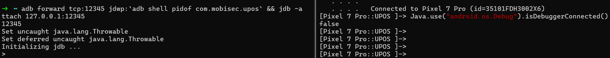

# NotDebuggingISwear
## Description
Simple LSPosed module that hooks calls to the isDebuggerConnected() function to avoid JDWP debugging detection. This project is based on [YukiHook](https://github.com/HighCapable/YukiHookAPI) and was created using their [Project Builder](https://github.com/HighCapable/YukiHookAPI-ProjectBuilder).

## Usage as template
Do bare in mind that hooks (inside the `onHook` method) need to be encased inside either a `loadSystem`, `loadApp` or `loadZygote` block. These decide who will be the target application/process to which hooks will be applied, let's call this entity `A`. Let's imagine that entity `A` makes a call to method `B` of class `C` which we would like to hook. Even if `B` is part of the Android framework and does not belong to `A`, `A` will always be the caller, not the callee.

For more information regarding hooks check out [YukiHook's docs](https://github.com/HighCapable/YukiHookAPI).

## Screenshots

